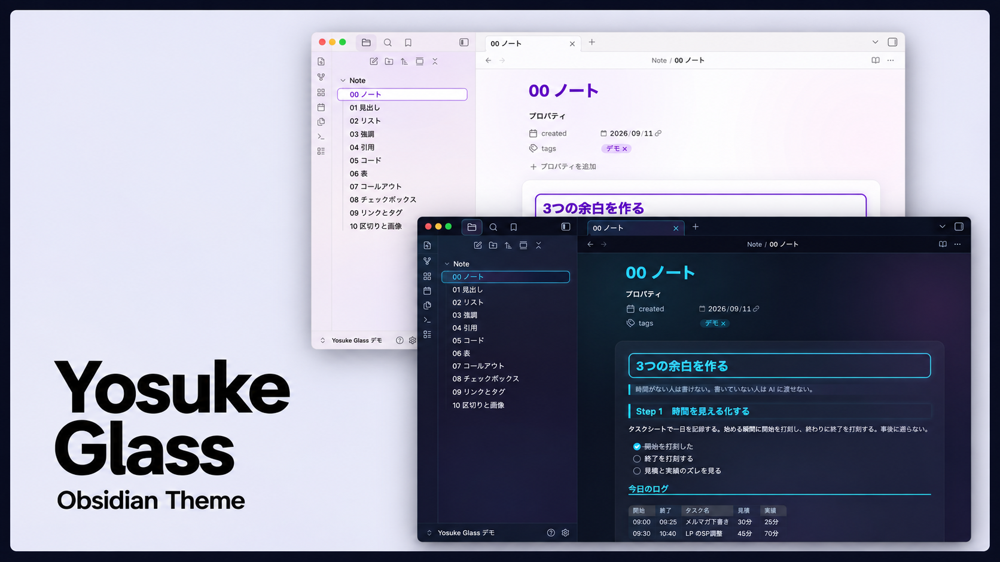

# Yosuke Glass

A glass-and-neon theme for Obsidian with a Japanese-first font stack.

- **Dark: Future Glass** — deep navy ground, frosted-glass panels, cyan / purple / pink neon accents.
- **Light: Paper** — warm paper ground, white note card, the same accents toned down for reading.
- **Japanese typography first** — Hiragino Sans (macOS / iOS) → Yu Gothic (Windows) → Noto Sans CJK (Android) so bold headings render properly in Japanese. Latin falls back to Inter / system fonts. No fonts are downloaded; nothing leaves your device.
- **Written to be maintainable** — variables first, Obsidian's `--color-base-*` ladder for both modes, one feature per section, edit view and reading view always styled as a pair, and **zero `!important`**.

## Companion plugin

**Yosuke Design** (companion plugin, not yet published) is the settings panel for this theme: light/dark palettes, typography, Nick Milo–style folder color bands, custom fonts from your vault, and a `design.md` file you can hand to any AI to restyle your vault. The theme works on its own; the plugin requires the theme.

## Install

Settings → Appearance → Themes → Manage → search **Yosuke Glass**.

Manual: copy `manifest.json` and `theme.css` into `.obsidian/themes/Yosuke Glass/` and select the theme.

## Structure of `theme.css`

1. `body { }` — variables only (palette, neon colors, fonts, sizes, radii)
2. `.theme-dark` / `.theme-light` — the `--color-base-00…100` ladder and accent HSL
3. Per-feature styling, only where variables cannot reach (each block styles edit view and reading view together)
4. Third-party plugin overrides (isolated at the end)

## License

MIT

---

## 日本語

ガラスとネオンの Obsidian テーマ。黒は **Future Glass**（濃紺の地・すりガラスの面・シアン／パープル／ピンクのネオン）、白は **Paper**（紙の地・白いノートカード・同じアクセントを読みやすく落とした配色）。

フォントは日本語優先。Hiragino Sans → Yu Gothic → Noto Sans CJK の順で、見出しの太字がちゃんと出ます。フォントのダウンロードや通信はしません。

相棒プラグイン **Yosuke Design** で、色・フォント・フォルダの色帯・Vault 内フォントの読み込み・`design.md` による一括適用ができます（テーマ単体でも動きます）。
